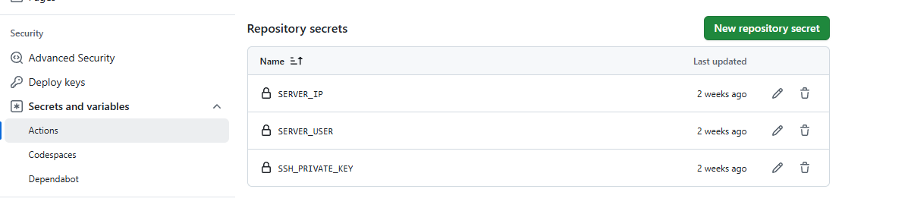

# GitHub Actions 工作流指南（CI/CD）

> Create by **Yelv** on 02 2025/3/16

## 什么是 GitHub Actions？

GitHub Actions 是 GitHub 提供的持续集成和持续部署（CI/CD）服务，它可以自动化你的软件开发工作流程。通过 GitHub Actions，你可以构建、测试和部署你的代码，而无需离开 GitHub 平台。

## 工作流基础概念

### 1. 核心概念

- **工作流（Workflow）**：一个自动化的过程，由一个或多个作业（jobs）组成
- **事件（Event）**：触发工作流的特定活动，如 push、pull request 等
- **作业（Job）**：工作流中的一系列步骤，在同一运行器上执行
- **步骤（Step）**：作业中的单个任务，可以运行命令或使用动作
- **动作（Action）**：可重用的工作流程单元

### 2. 工作流文件结构

工作流配置文件必须存储在仓库的 `.github/workflows` 目录中，使用 YAML 格式。以下是一个基本的工作流文件结构：

```yaml
name: 工作流名称

on: # 触发条件
  push:
    branches: [main]

jobs:
  build: # 作业名称
    runs-on: ubuntu-latest # 运行环境

    steps: # 步骤列表
      - name: 步骤名称
        uses: actions/xxx@v1 # 使用的动作
        with: # 动作的输入参数
          param: value
```

## 实际项目配置示例

以下是我们项目中使用的部署工作流配置（deploy.yml）：

```yaml
name: Deploy to Server

on:
  push:
    branches:
      - main

jobs:
  deploy:
    runs-on: ubuntu-latest

    steps:
      - name: Checkout repository
        uses: actions/checkout@v4
        with:
          fetch-depth: 0
          lfs: true

      - name: Setup Node.js
        uses: actions/setup-node@v3
        with:
          node-version: '18'

      - name: Install dependencies
        run: npm install

      - name: Fix permissions for docusaurus
        run: chmod +x node_modules/.bin/docusaurus

      - name: Build project
        run: |
          npm run build

      - name: Setup SSH key
        uses: webfactory/ssh-agent@v0.9.0
        with:
          ssh-private-key: ${{ secrets.SSH_PRIVATE_KEY }}

      - name: Deploy to server
        run: |
          rsync -avz -e "ssh -p 22" ./build/ ${{ secrets.SERVER_USER }}@${{ secrets.SERVER_IP }}:/www/wwwroot/www.yelv.site
```

### 配置说明

1. **触发条件**：当代码推送到 main 分支时触发工作流
2. **运行环境**：使用最新版本的 Ubuntu
3. **主要步骤**：
   - 检出代码仓库
   - 设置 Node.js 环境
   - 安装项目依赖
   - 构建项目
   - 配置 SSH 密钥
   - 部署到服务器

## 最佳实践

### 1. 安全性考虑

- 使用 GitHub Secrets 存储敏感信息
- 限制工作流的权限
- 定期更新 Actions 版本

### 2. 性能优化

- 使用缓存加速构建
- 合理设置触发条件
- 优化作业依赖关系

### 3. 配置建议

```yaml
# 使用缓存示例
steps:
  - uses: actions/cache@v3
    with:
      path: ~/.npm
      key: ${{ runner.os }}-node-${{ hashFiles('**/package-lock.json') }}

# 条件执行示例
steps:
  - name: Deploy
    if: github.ref == 'refs/heads/main'
    run: npm run deploy
```

## 常见问题解决

### 1. 权限问题

如果遇到权限相关的错误，可以：

- 检查 SSH 密钥配置
- 检查 SSH 密钥权限

  > 注意：首先需要在 GitHub 仓库的 Secrets 中添加 SSH_PRIVATE_KEY 变量和 SERVER_USER、SERVER_IP 变量。
  > 其中 SSH_PRIVATE_KEY 是 SSH 私钥的内容，SERVER_USER 是服务器用户名，SERVER_IP 是服务器 IP 地址。
  > 在 linux(centos/Ubuntu)系统中配置 SSH 密钥步骤如下：
  >
  > 
  >
  > 1. 生成 SSH 密钥对
  >
  > ```bash
  > ssh-keygen -t rsa -b 4096 -C "> ssh-keygen -t rsa -b 4096 -C "EMAIL"
  > ```
  >
  > 2. 将公钥添加到服务器
  >
  > ```bash
  > ssh-copy-id -i ~/.ssh/id_rsa.pub USER@SERVER_IP
  > ```
  >
  > 3. 测试连接
  >
  > ```bash
  > ssh -p 22 USER@SERVER_IP
  > ```
  >
  > 4. 将私钥添加到 GitHub Secrets
  >
  > ```bash
  > cat ~/.ssh/id_rsa
  > ```
  >
  > 5. 将私钥内容复制到 GitHub Secrets
  >
  > ```bash
  > cat ~/.ssh/id_rsa.pub
  > ```

- 确保目标目录有正确的写入权限
- 使用 `chmod` 命令修复权限

### 2. 构建失败

常见原因和解决方案：

- 依赖安装失败：检查 package.json 配置
- 环境变量缺失：确保所有必要的 secrets 都已配置
- 构建脚本错误：检查 build 命令配置

## 进阶配置

### 1. 矩阵构建

```yaml
jobs:
  build:
    strategy:
      matrix:
        node-version: [14.x, 16.x, 18.x]
    steps:
      - uses: actions/setup-node@v3
        with:
          node-version: ${{ matrix.node-version }}
```

### 2. 工作流组合

```yaml
jobs:
  test:
    runs-on: ubuntu-latest
    steps:
      - uses: actions/checkout@v3
      - run: npm test

  deploy:
    needs: test
    runs-on: ubuntu-latest
    steps:
      - run: npm run deploy
```

### 3. 注意事项

- 工作流文件必须存储在 `.github/workflows` 目录下
- 工作流文件必须以 `.yml` 或 `.yaml` 结尾
- 工作流文件必须使用 YAML 语法
- 工作流文件必须包含 `name` 和 `on` 字段
- 工作流文件可以包含多个作业（jobs）
- 作业过程中注意文件的权限问题和下载工具的版本

## 监控和维护

### 1. 工作流状态监控

- 使用 GitHub 的状态徽章
- 配置失败通知
- 定期检查工作流日志

### 2. 持续优化

- 分析工作流执行时间
- 优化构建和测试过程
- 更新依赖和 Actions 版本

## CI/CD 实践指南

### 1. 持续集成（CI）实践

- **自动化测试**：每次代码提交后自动运行测试
- **代码质量检查**：集成 ESLint、Prettier 等工具
- **构建验证**：确保代码可以成功构建

```yaml
name: CI Pipeline

on: [push, pull_request]

jobs:
  test:
    runs-on: ubuntu-latest
    steps:
      - uses: actions/checkout@v4
      - uses: actions/setup-node@v3
        with:
          node-version: '18'
      - run: npm install
      - run: npm test
```

### 2. 持续部署（CD）实践

- **环境分离**：区分开发、测试、生产环境
- **自动化部署**：配置自动部署流程
- **回滚机制**：确保可以快速回滚到稳定版本

```yaml
name: CD Pipeline

on:
  push:
    branches: [main]

jobs:
  deploy:
    runs-on: ubuntu-latest
    environment: production
    steps:
      - uses: actions/checkout@v4
      - name: Deploy to Production
        run: |
          # 部署脚本
```

### 3. 使用建议

1. **分支策略**

   - 使用 feature 分支开发新功能
   - 通过 pull request 合并代码
   - 保护主分支，确保代码质量

2. **环境配置**

   - 使用环境变量管理配置
   - 区分不同环境的部署配置
   - 确保敏感信息的安全性

3. **监控和告警**
   - 配置部署状态通知
   - 设置关键指标监控
   - 建立问题响应机制

### 4. 常见场景示例

1. **前端项目部署**

```yaml
name: Frontend Deploy

on:
  push:
    branches: [main]

jobs:
  build-and-deploy:
    runs-on: ubuntu-latest
    steps:
      - uses: actions/checkout@v4
      - uses: actions/setup-node@v3
        with:
          node-version: '18'
      - run: npm install
      - run: npm run build
      - name: Deploy to Server
        uses: appleboy/scp-action@master
        with:
          host: ${{ secrets.HOST }}
          username: ${{ secrets.USERNAME }}
          key: ${{ secrets.KEY }}
          source: 'dist/*'
          target: '/var/www/html'
```

2. **后端服务部署**

```yaml
name: Backend Deploy

on:
  push:
    branches: [main]

jobs:
  deploy:
    runs-on: ubuntu-latest
    steps:
      - uses: actions/checkout@v4
      - name: Deploy to Server
        uses: appleboy/ssh-action@master
        with:
          host: ${{ secrets.HOST }}
          username: ${{ secrets.USERNAME }}
          key: ${{ secrets.KEY }}
          script: |
            cd /var/www/app
            git pull
            npm install
            pm2 restart app
```

### 5. 最佳实践总结

1. **安全性**

   - 使用 GitHub Secrets 存储敏感信息
   - 限制工作流权限
   - 定期更新依赖和 Actions

2. **效率**

   - 使用缓存加速构建
   - 并行执行独立任务
   - 优化触发条件

3. **可维护性**

   - 保持工作流配置简洁
   - 添加必要的注释
   - 定期审查和优化配置

4. **可靠性**
   - 添加错误处理机制
   - 配置监控和告警
   - 建立回滚策略

#
