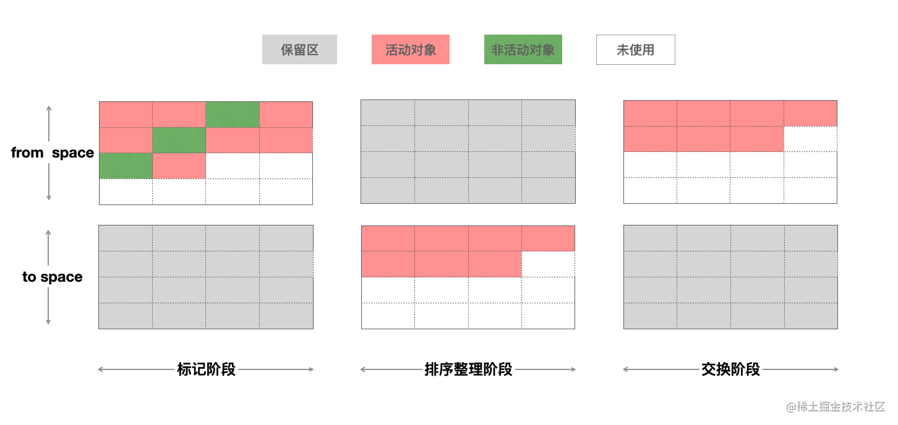
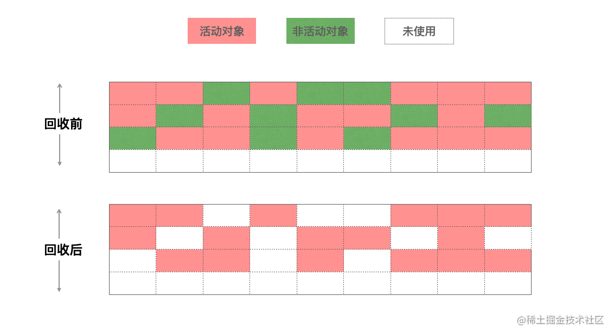
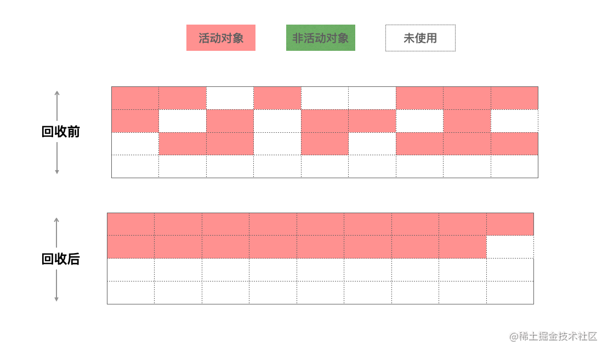

> Create by **fall** on 09 Sep 2021
> Recently revised in 13 Oct 2023

## 垃圾回收 

**为什么要进行垃圾回收？**

chrome 限制了 v8 引擎的内存使用（64 位约 1.4G/1464MB，32位约 0.7G/732MB）

内存大小的设置有两层原因，浏览器本身不可能遇到大量使用内存的场景。而且，清理内存很耗时间，会引起线程暂停，性能也会下降。

JS 引擎来手动的释放内存时。代码书写错误，会使垃圾回收机制无法正确对内存进行释放，从而使浏览器占用内存不断增加，JavaScript 和应用、操作系统性能下降。

### 回收机制

在 JavaScript 中，数据类型分为两类，简单类型（基本类型）和引用类型，对于简单类型，内存是保存在栈（stack）空间中，复杂数据类型，内存是保存在堆（heap）空间中。

- 基本类型：这些类型在内存中分别占有固定大小的空间，他们的值保存在栈空间，我们通过按值来访问的。
  - 而对于栈的内存空间，只保存简单数据类型的内存，**由操作系统自动分配和自动释放**。
- 引用类型：引用类型，值大小不固定，栈内存中存放地址指向堆内存中的对象。是按引用访问的。
  - 而堆空间中的内存，由于大小不固定，系统无法无法进行自动释放，这个时候就需要**JS引擎来手动的释放这些内存**。当代码书写错误时，会使垃圾回收机制无法正确对内存进行释放，从而使浏览器占用内存不断增加，也就是[内存泄漏](./5.2-内存泄漏.md)。

大多数对象存活周期都很短，经历过一次垃圾回收后，就被释放掉，为了提高内存利用效率，堆被分成了两个部分。

- 新生代（Young Generation）新生代中存放的是生存时间短的对象（通常为 1 - 8M 容量）
  - 新生代包括 Nursery 和 Intermediate
- 老生代（Old Generation）存放生存时间久的对象（支持容量会大很多）

所以有两个垃圾回收器：

副垃圾回收器 - `Scavenge` 主要负责新生代的垃圾回收。

主垃圾回收器 - `Mark-Sweep & Mark-Compact` 主要负责老生代的垃圾回收（数据量大，数据存活时间长）。

### 新生代垃圾回收

**Scavenge**

副垃圾回收器 - `Scavenge` 

副垃圾回收器负责新生代垃圾回收，小对象（1 ～ 8M）会被分配到该区域处理

任何对象声明分配到的内存，会先放置到新生代中，特点是存活周期很短。

新生代采用 scavenge 算法处理：将新生代空间分为两半，一半空闲，一半存对象，对对象区域做标记，存活对象复制排列到空闲区域，没有内存碎片，完成后，清理对象区域，角色反转；

分别叫 `from-space` 和 `to-space`，工作方式也很简单，就是将 `from-space` 中存活的活动对象复制到 `to-space` 中，并将这些对象的内存有序的排列起来，然后将 `from-space` 中的非活动对象的内存进行释放，完成之后，将`from space` 和 `to space` 进行互换，这样可以使得新生代中的这两块区域可以重复利用。

总结来讲，就是

- 标记非活动对象
- 把非活动对象从 `from space`复制到 `to space` 进行排序
- 释放 `from space` 的内存
- 把二者角色互换

如何判断是否是非活动对象呢？

新生代区域采用标记 - 清除算法回收垃圾：从根元素开始，递归，可到达的元素活动元素，否则是垃圾数据；

<u>对象的可达性</u>
表示从初始的根对象（window，global）的指针开始（ES6 提出了 `globalThis` 同时作为 node 和 browser 的跟指针），这个根指针对象被称为根集（root set），从这个根集向下搜索其子节点，被搜索到的子节点说明该节点的引用对象可达，并为其留下标记，然后递归这个搜索的过程，直到所有子节点都被遍历结束，那么没有被标记的对象节点，说明该对象没有被任何地方引用，可以证明这是一个需要被释放内存的对象，可以被垃圾回收器回收。

新生代对象什么时候变成老生代对象？

在新生代中，还进一步进行了细分，分为`nursery`子代和`intermediate`子代两个区域，一个对象第一次分配内存时会被分配到新生代中的`nursery`子代，如果进过下一次垃圾回收这个对象还存在新生代中，这时候我们移动到 `intermediate` 子代，再经过下一次垃圾回收，如果这个对象还在新生代中，副垃圾回收器会将该对象移动到老生代中，这个移动的过程被称为晋升。

### 老生代垃圾回收

新生代区域两次垃圾回收还存活的对象晋升至老生代区域；

垃圾回收器：Mark-Sweep & Mark-Compact

对于老生代对象来说，如果再使用新生代的 `scavenge` 算法的话，会出现两个问题：

- 重复的复制算法导致效率低下
- `scavenge` 是牺牲空间换取时间的算法，老生代空间大，会导致浪费大量的空间

所以清除方法是：标记清除（`Mark-Sweep`），标记整理（`Mark-Compact`）

标记清除：标记了活动对象后，直接把非活动对象清除

- 标记阶段：老生代进行第一次扫描，标记活动对象
- 清理阶段：对老生代进行第二次扫描，清除未被标记的对象，清理非活动对象

但是回收结束后，会产生相当多的内存碎片接下来需要进行：标记整理

标记整理：如果不清理这些对象，会导致下一次分配一个大对象时，空间碎片都无法进行分配。

将所有的活动对象往一端移动，移动完成后，直接清理掉边界外的内存。

### 全停顿

垃圾回收在 JS 引擎中进行的，Mark-Compact 算法需要移动对象，当活动的对象比较多，执行速度就会变慢，为了避免垃圾回收期的内存资源竞争导致的不一致的问题，会进行**全停顿**（stop the world）将 JavaScript 应用暂停。

- 新生代中，空间小，存放对象少，Scavenge 执行效率快，全停顿影响不大
- 老生代中，对象较多，垃圾回收期会暂停主线程较长时间，导致界面变得卡顿

## 优化方法

Orinoco 是垃圾回收期的项目代号

V8 为了解决全停顿的问题，利用增量标记、懒性清理、并发、并行来降低主线程的挂起时间

### 增量标记

Incremental marking

增量标记会将原本的标记全堆对象拆分为一个一个任务，让其穿插在 JavaScript 应用逻辑之间执行，以此来降低垃圾回收的停顿时间。

增量标记允许堆的标记时的 5-10ms 的停顿。增量标记会在堆的大小达到一定阈值时启用，启用之后，每当一定量的内存分配后脚本的执行就会停顿，并进行一次增量标记。

### 懒清理

Lazy sweeping

增量标记只是对活动对象和非活动对象进行标记，惰性清理用来真正的释放内存。增量标记完成后，当可用内存足以快速执行代码时，是没有必要立即清理内存的。可以将清理的过程推迟，让 JS 逻辑代码先去执行。也无需一次性清理所有非活动对象的内存，垃圾回收期会逐一按需清理，直到所有页都清理完毕。

> 增量标记和懒清理让主线成最大停顿时间减少了 80%，用户的交互变得流畅了许多，但是从实现机制上，每个增量标记之间执行了 JavaScript 代码，堆中对象指针可能发生变化，需要**写屏障**来记录这些引用关系的变化。
>
> 所以，懒清理的缺点也就显而易见
>
> - 并没有减少主线程的总暂停时间，甚至可能略微增加
> - 写屏障（write-barrier）机制的成本，表计量会降低应用程序的吞吐量

### 并发

Concurrent

并发不需要将主线程挂起，可以同时进行，只有个别时候需要短暂停下来去做一些事，两者可以同时进行，只有个别时间需要做一些特殊操作，也要面对增量回收的问题，由于JS代码在执行，引用关系也会变化，也需要写屏障

### 并行

Parallel

允许主线程和辅助线程做相同的GC工作，可以让辅助线程来分担主线程的GC工作，使得垃圾回收所耗费的时间等于总时间除以参与的线程的数量（会有一些同步开销）

## V8 当前回收机制

2011 年，V8 应用了增量标记。2018年，Chrome64 和 Node.js V10 启动并发标记，同时在并发的基础上添加并行技术，使得垃圾回收时间大幅度缩短

### 副垃圾回收器

当活动对象从 from-to 复制到 `space-to` 的时候，会启用多个辅助线程，并行进行整理。多个线程竞争一个新生代的堆得内存资源，可能出现有某个活动对象被多个线程进行复制操作的问题，为了解决这个问题，V8在第一个线程对活动对象进行复制并且复制完成后，都必须去维护复制这个活动对象后的指针转发地址，以便于其他协助线程可以找到该活动对象后可以判断该活动对象是否已被复制。

### 主垃圾回收器

当堆中的内存大小超过某个阈值之后，会启用并发，标记任务，每个辅助线程都会去追踪每个标记到的对象的指针以及对这个对象的引用。

在JS代码执行中，并发标记也在后台的辅助进程中进行，当某个指针对象被 JS 修改时，写入屏障技术会在辅助线程并发表及的时候，进行追踪。

当并发标记完成或者动态分配的内存达到极限的时候，住线程会执行最终的快速标记步骤，这个时候，主线程会挂起，进行再一次的扫描根集以确保所有的对象都完成了标记。由于辅助线程已经标记过活动对象，主线程的本次扫描只是进行check操作，确认完成之后，某些辅助线程会进行清理内存操作，某些辅助进程会进行内存整理操作，由于都是并发的，并不会影响主线程JavaScript代码的执行。

内存使用观察是否存在内存泄漏，而防止内存泄漏，是提升应用性能的一个重要举措。

## 参考文章

| 作者   | 链接                                       |
| ------ | ------------------------------------------ |
| 杨溜溜 | https://juejin.cn/post/6876638765025067015 |

| 相关文章 | 链接                                        |
| -------- | ------------------------------------------- |
| 写入屏障 | https://dl.acm.org/doi/book/10.5555/2025255 |

